# iOSAppHackingLab

[](https://github.com/jungyeons/iOSAppHackingLab/actions/workflows/self-check.yml)
[](artifacts/media-manifest.json)

iOS 앱 해킹 공부를 위해 SwiftUI로 만든 로컬 실습 앱입니다. 실제 서비스나 타인 앱을 대상으로 하지 않고, 의도적으로 취약하게 만든 앱 안에서만 관찰하고 실험하도록 구성했습니다.

Public portfolio repository: https://github.com/jungyeons/iOSAppHackingLab

## 실행

### Swift Package

```bash
cd /Users/jungyeons/Documents/Projects/AppWhitehackLab
swift run
```

### Xcode iOS Simulator

```bash
open iOSAppHackingLab.xcodeproj
xcodebuild -project iOSAppHackingLab.xcodeproj \
  -scheme iOSAppHackingLab \
  -configuration Debug \
  -destination 'platform=iOS Simulator,name=iPhone 17 Pro,OS=latest' \
  -derivedDataPath .build/XcodeDerivedData \
  CODE_SIGNING_ALLOWED=NO build
```

The same SwiftUI lab runs as a Swift Package app on macOS and as a native Xcode app target on iOS Simulator.

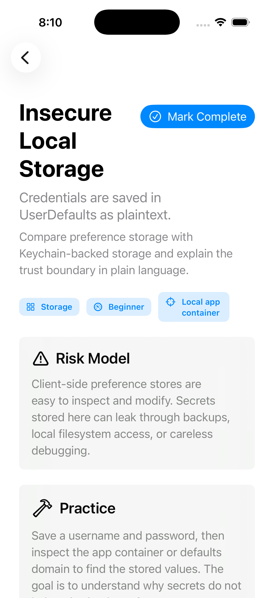

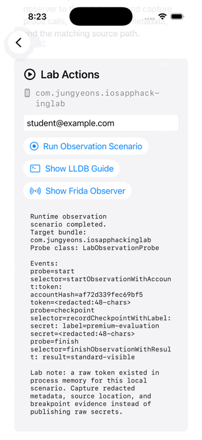

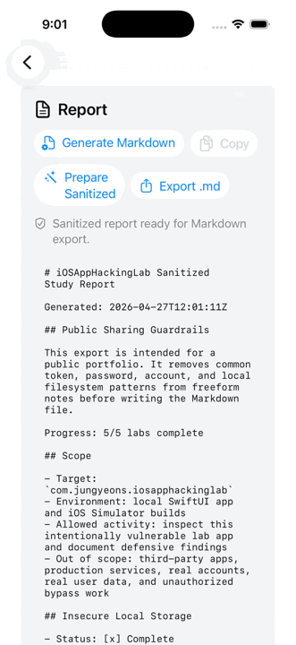


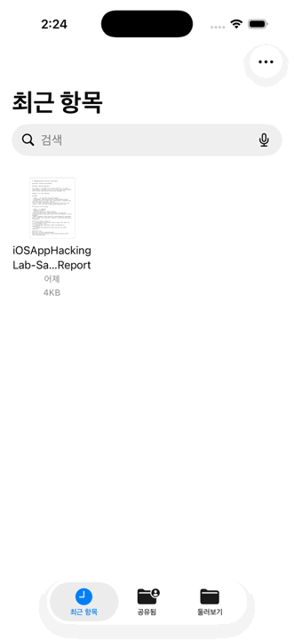

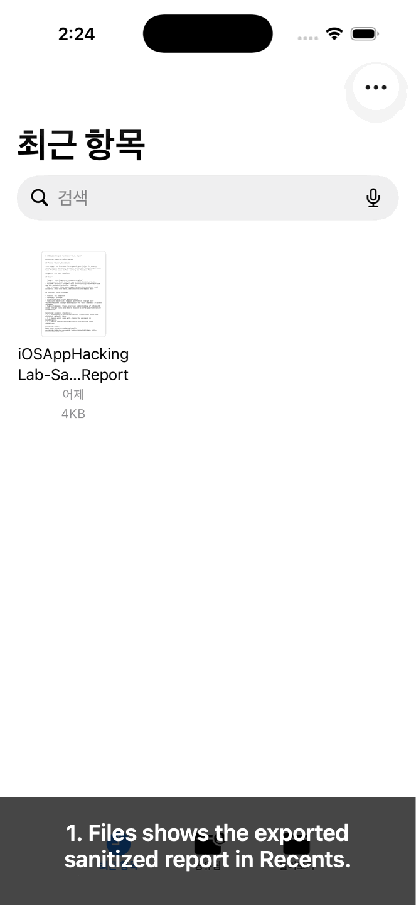

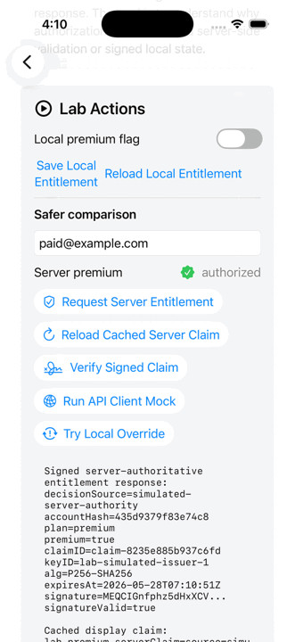

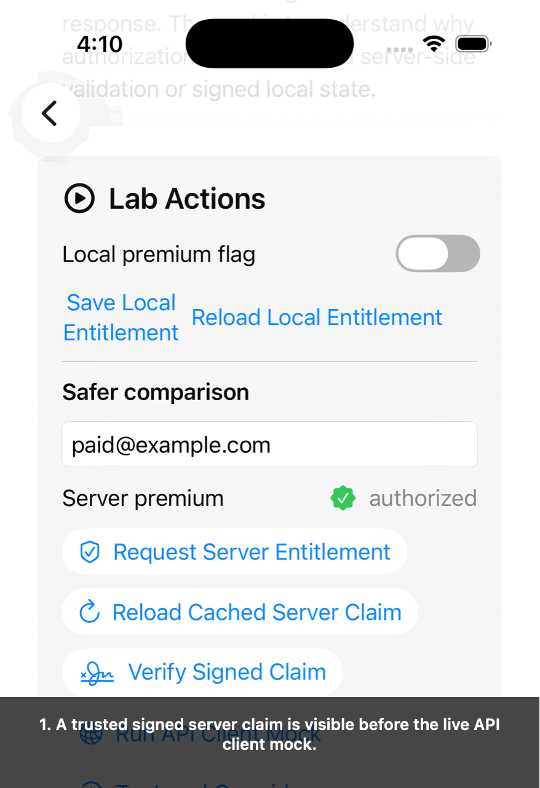

| Runtime run | LLDB guide | Frida observer |
| --- | --- | --- |
| 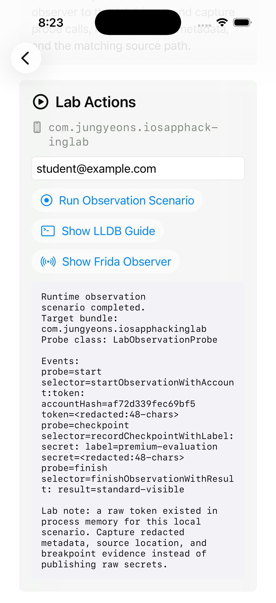 | 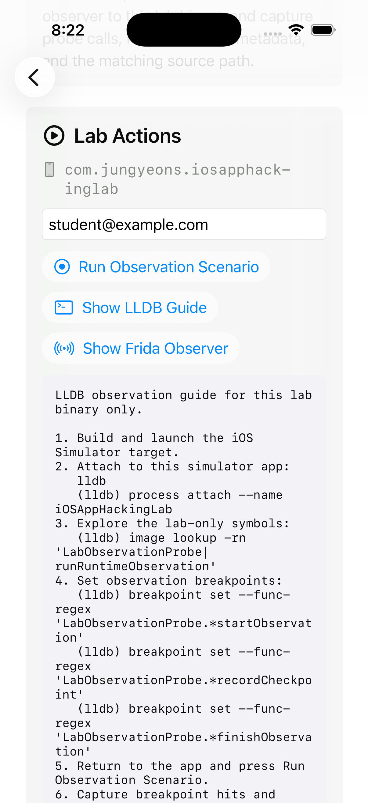 | 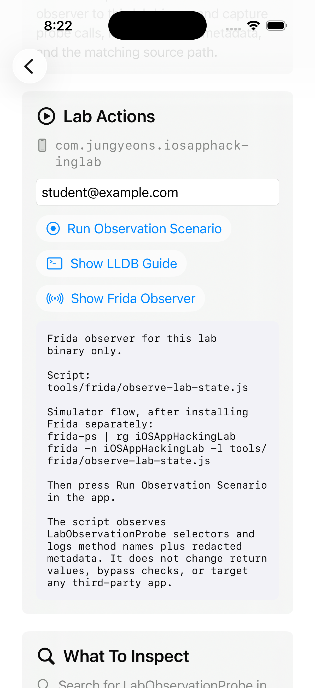 |

| Local override denied | Server-authorized premium |
| --- | --- |
| 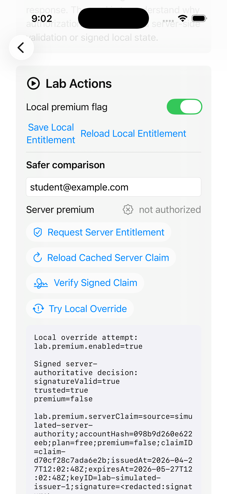 | 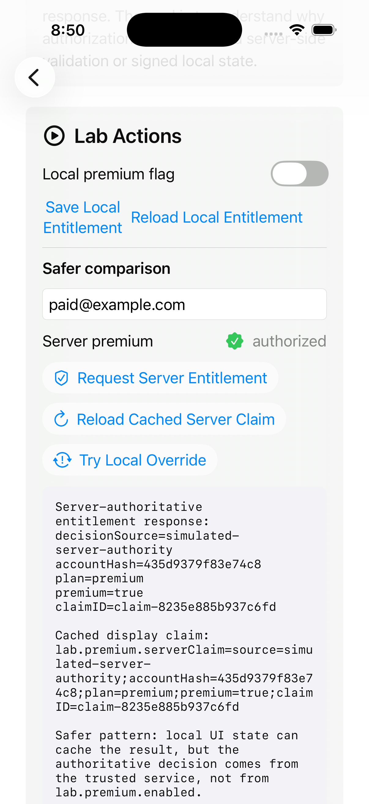 |

| Signed entitlement API client mock |
| --- |
| 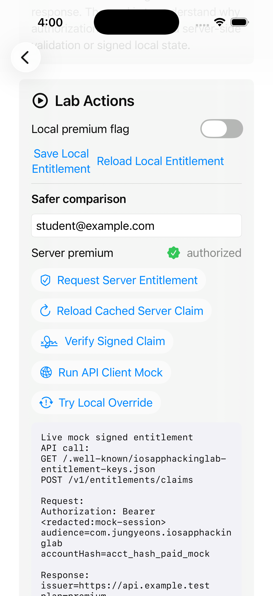 |

| Sanitized report export history |
| --- |
| 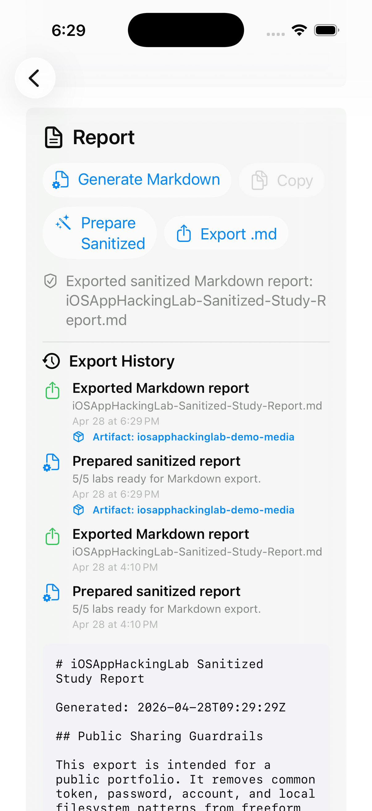 |

| Export ready | Storage picker | Export saved |
| --- | --- | --- |
| 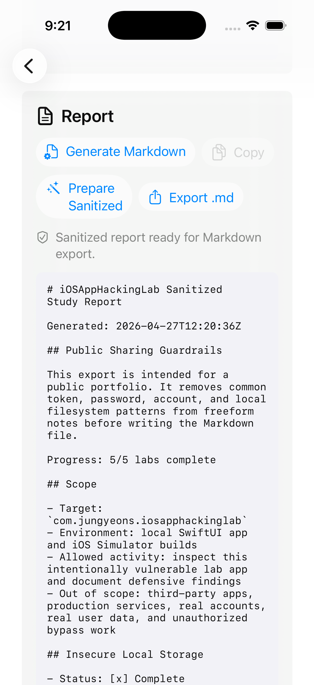 | 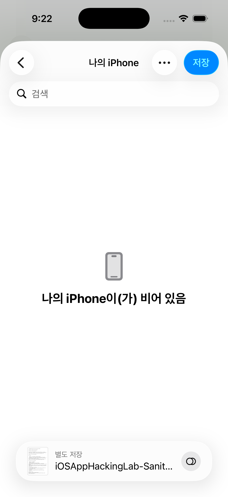 | 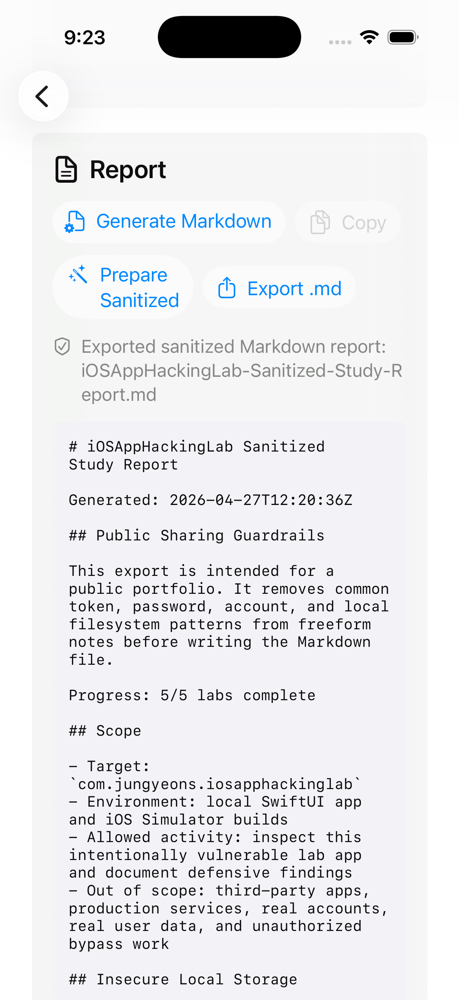 |

| Files recent item | Reopened sanitized report |
| --- | --- |
|  | 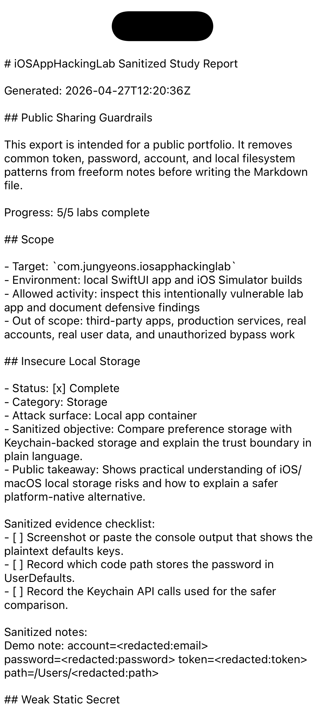 |

## 현재 기능

- 랩별 진행률 체크
- 랩별 학습 노트 저장
- 취약 패턴과 안전한 구현 패턴 비교
- Markdown 학습 리포트 생성
- Sanitized Markdown 리포트 export
- Sanitized report export history panel과 Actions artifact 링크 필드
- Files 앱에서 export 결과 재오픈 캡처
- UserDefaults와 Keychain 저장 방식 비교
- 민감 로그와 redacted event log 비교
- 로컬 entitlement와 서명 검증 기반 server-authoritative 모델 비교
- Swift async signed entitlement API client stub와 앱 화면 live mock action
- 증거 캡처 체크리스트와 포트폴리오용 takeaway 정리
- `--self-check` 내장 검증 모드
- GitHub Actions 기반 self-check CI, screenshot dimension 검증, media manifest artifact
- Xcode 기반 iOS Simulator 타깃
- LLDB/Frida 관찰용 lab-only runtime probe
- 시뮬레이터 스크린샷과 짧은 demo GIF

## 포함된 랩

- Insecure Local Storage: `UserDefaults` 평문 저장과 Keychain 저장 비교
- Weak Static Secret: 하드코딩된 XOR 키로 payload 인코딩
- Sensitive Debug Logging: 민감한 토큰 로그와 redacted 로그 비교
- Tamperable Entitlement: 로컬 boolean 권한과 P256-SHA256 signed claim 비교
- Runtime Observation Drill: LLDB/Frida로 이 앱의 lab-only probe 관찰

## 프로젝트 구조

```text
Sources/iOSAppHackingLab/
  Models/        랩 메타데이터와 체크리스트
  Store/         진행률, 노트, 취약 동작, 리포트 생성
  Security/      Keychain 비교와 signed entitlement API client stub
  Views/         SwiftUI 화면과 랩별 액션 UI
iOSAppHackingLab.xcodeproj/
  xcshareddata/  공유 Xcode scheme
docs/
  ARCHITECTURE.md
  INSTRUMENTATION.md
  LEARNING_ROADMAP.md
  RELEASE_DRAFT.md
  RELEASE_NOTES_TEMPLATE.md
  SAMPLE_STUDY_REPORT.md
  SECURITY_SCOPE.md
  SIMULATOR_STORAGE.md
tools/
  frida/        Lab-only Frida observer
  lldb/         Lab-only LLDB command file
  make-demo-gif.swift
  make-captioned-demo-gif.swift
  generate-media-manifest.swift
  generate-release-draft.swift
  verify-demo-media.swift
```

## 연습 순서

1. 앱에서 각 랩의 버튼을 눌러 데이터를 생성합니다.
2. 소스에서 관련 키워드를 검색합니다.
3. 저장 위치, 로그, 하드코딩된 값을 직접 확인합니다.
4. 왜 취약한지 적고 더 안전한 설계를 생각합니다.
5. 앱에서 Markdown 리포트를 생성해 학습 기록으로 남깁니다.
6. 공개 포트폴리오에 올릴 때는 Sanitized report export를 사용합니다.

## 유용한 명령

```bash
rg "lab\\.|weakKey|NSLog" .
rg "LabObservationProbe|runRuntimeObservation" .
rg "lab.premium.serverClaim|SimulatedEntitlementAuthority|Verify Signed Claim" .
swift run
swift run iOSAppHackingLab --self-check
swift tools/verify-demo-media.swift
swift tools/generate-media-manifest.swift
xcrun simctl list devices available
xcrun simctl launch --terminate-running-process booted com.jungyeons.iosapphackinglab --lab tamperable-state --demo entitlement-override
xcrun simctl launch --terminate-running-process booted com.jungyeons.iosapphackinglab --lab tamperable-state --demo entitlement-paid
xcrun simctl launch --terminate-running-process booted com.jungyeons.iosapphackinglab --lab tamperable-state --demo entitlement-api-mock
xcrun simctl launch --terminate-running-process booted com.jungyeons.iosapphackinglab --demo sanitized-report-exported
swift tools/make-demo-gif.swift artifacts/ios-simulator-runtime-demo.gif \
  artifacts/ios-simulator-runtime-run.png \
  artifacts/ios-simulator-runtime-lldb.png \
  artifacts/ios-simulator-runtime-frida.png
swift tools/make-demo-gif.swift artifacts/ios-simulator-report-export-demo.gif \
  artifacts/ios-simulator-report-export-ready.png \
  artifacts/ios-simulator-report-exported.png
swift tools/make-demo-gif.swift artifacts/ios-simulator-report-export-location-flow.gif \
  artifacts/ios-simulator-report-export-location-ready.png \
  artifacts/ios-simulator-report-export-location-picker.png \
  artifacts/ios-simulator-report-export-saved-location.png
swift tools/make-demo-gif.swift artifacts/ios-simulator-report-export-files-reopen.gif \
  artifacts/ios-simulator-report-export-files-recent.png \
  artifacts/ios-simulator-report-export-files-preview.png
swift tools/make-demo-gif.swift artifacts/ios-simulator-entitlement-api-client-mock.gif \
  artifacts/ios-simulator-entitlement-api-client-ready.png \
  artifacts/ios-simulator-entitlement-api-client-mock.png
swift tools/make-captioned-demo-gif.swift --mobile-crop artifacts/ios-simulator-entitlement-api-client-mock-captioned.gif \
  'artifacts/ios-simulator-entitlement-api-client-ready.png::1. A trusted signed server claim is visible before the live API client mock.' \
  'artifacts/ios-simulator-entitlement-api-client-mock.png::2. The async client calls key discovery and claim endpoints, then redacts the mock session token.'
swift tools/make-captioned-demo-gif.swift --mobile-crop artifacts/ios-simulator-report-export-files-reopen-narrated.gif \
  'artifacts/ios-simulator-report-export-files-recent.png::1. Files shows the exported sanitized report in Recents.' \
  'artifacts/ios-simulator-report-export-files-preview.png::2. Preview reopens the Markdown without exposing raw secrets.'
swift tools/generate-release-draft.swift --version v0.1.0 --date 2026-04-28
```

## 안전 범위

이 저장소는 로컬 학습용입니다. 타인 앱, 실서비스, 실제 사용자 데이터, 권한이 없는 기기나 계정은 범위 밖입니다. Frida/LLDB 자료도 이 앱의 simulator build만 대상으로 합니다. 자세한 범위는 `docs/SECURITY_SCOPE.md`에 정리했습니다.

## 문서

- [Simulator storage inspection](docs/SIMULATOR_STORAGE.md)
- [Runtime instrumentation lab](docs/INSTRUMENTATION.md)
- [Sanitized report export flow](docs/REPORT_EXPORT_FLOW.md)
- [Signed entitlement API contract](docs/SIGNED_ENTITLEMENT_API.md)
- [GitHub Actions demo artifacts](docs/CI_ARTIFACTS.md)
- [Release notes template](docs/RELEASE_NOTES_TEMPLATE.md)
- [Generated GitHub release draft](docs/RELEASE_DRAFT.md)
- [Sanitized sample study report](docs/SAMPLE_STUDY_REPORT.md)

## 다음 단계

- GitHub release draft를 실제 draft release로 생성하는 수동 승인 흐름 추가
- Export history panel에서 최근 Actions run URL을 자동 감지
- Captioned GIF 생성 옵션을 README용/모바일용 프리셋으로 분리
